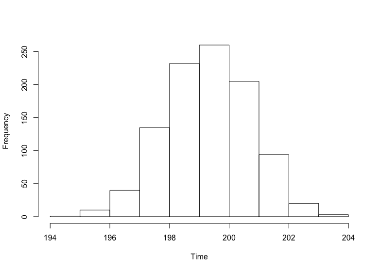

  
```{r setup, include=FALSE}
knitr::opts_chunk$set(echo = TRUE)
```

\newpage

# 1. Linear and polynomial regression

## 1a)

Before looking at the data, we came to the conclusion that the intercept should be about -10 degrees, with a cyclic temperature throughout the year and a maximum at 7 months. The variance was adjusted in order for the prior regression curve to be in accordance with our prior beliefs. Draws were made from the prior and plotted along with the temperature readings for comparison, as can be seen in Figure 1.

$\mu_{0}$ = [-10, 100, -90]

$v_0 = 4\\$
$\sigma_0^{2} = 8\\$

$\Omega_{0}$ = $$
\left(\begin{array}{ccc} 
10 & 0 & 0\\
0 & 10 & 0\\
0 & 0 & 10\\
\end{array}\right)
$$


\newpage

## 1b)


\newpage

The figure below shows the plotted data along with the curve for the posterior median of the regression function. Furthermore, a 95 % credible interval has been calculated. The interval bands doesn't contain most of the data points due to the high credibility.


\newpage

## 1c)

The highest expected temperature was calculated using the derivative of the time function, with respect to time.

$$\begin{aligned}
\frac{\partial f}{\partial t} = \beta_1 + 2\beta_2 t = 0 \iff t = -\frac{\beta_1}{2\beta_2}\\
0\leq t\leq 1 \Rightarrow 0\leq \bar{x} \leq 366 \iff \bar{x} = 366 * t\\
\end{aligned}$$

The histogram of $\bar{x}$ can be seen in Figure 4.



\begin{table}[ht]
\centering
\begin{tabular}{rrrrrrr}
  \hline
 & Min. & 1st Qu. & Median. & Mean & 3rd Qu. & Max. \\ 
  \hline
1 & 194.54 & 198.30 & 199.27 & 199.29 & 200.26 & 203.37 \\ 
   \hline
\end{tabular}
\caption{Summary of $\bar{x}$} 
\end{table}

This is in line with the output from `which.max(y_med)` = 200, where `y_med` is the posterior mean from a).

\newpage

## 1d)

Using the posterior parameters from 1b) as the first three betas, the new beta parameters would be set to zero due to suspicion that the introduced variables might not be needed.
Regarding the covariance matrix, we want low variance (high bias) to avoid overfitting, giving high diagonal values in $\Omega_0$ for the new variables, with the rest set to zero since we can't say anything about the covariance between the new variables.


\begin{table}[ht]
\centering
\begin{tabular}{rrrrrrrrr}
  \hline
 $\beta_0$. & $\beta_1$ & $\beta_2$ & $\beta_3$ & $\beta_4$ & $\beta_5$ & $\beta_6$ & $\beta_7$\\ 
  \hline
-11.53113 & 98.43113 & -90.38911 & 0 & 0 & 0 & 0 & 0\\ 
   \hline
\end{tabular}
\caption{$\mu_0$} 
\end{table}

$\Omega_0$ = $$
\begin{pmatrix}
376 & 183.5 & 122.5 & 0 & 0 & 0 & 0 & 0 \\
183.5 & 132.5 & 92.5 & 0 & 0 & 0 & 0 & 0 \\
122.5 & 92.5 & 83.7 & 0 & 0 & 0 & 0 & 0 \\
0 & 0 & 0 & 100 & 0 & 0 & 0 & 0 \\
0 & 0 & 0 & 0 & 100 & 0 & 0 & 0 \\
0 & 0 & 0 & 0 & 0 & 100 & 0 & 0 \\
0 & 0 & 0 & 0 & 0 & 0 & 100 & 0 \\
0 & 0 & 0 & 0 & 0 & 0 & 0 & 100 \\
\end{pmatrix}
$$

\newpage

# 2. Posterior approximation for classification with logistic regression

## 2b) 

Numerical values for beta: 

\begin{table}[ht]
\centering
\begin{tabular}{rrrrrrrrr}
  \hline
 $\beta_0$. & $\beta_1$ & $\beta_2$ & $\beta_3$ & $\beta_4$ & $\beta_5$ & $\beta_6$ & $\beta_7$\\ 
  \hline
0.62672884 & 0.01979113 & 0.18021897 & 0.16756670 & -0.14459669 & -0.08206561 & -1.35913317 & -0.02468351\\ 
   \hline
\end{tabular}
\caption{$\beta$} 
\end{table}

Numerical values for the hessian: 

Hessian = $$
\begin{pmatrix}
2.2660225 & 3.3388e-03 & -6.5451e-02 & -1.1791e-02 &  0.04578072 & -3.0293e-02 & -0.1887483 & -0.098023 \\
0.0033388 & 2.5280e-04 & -5.6102e-04 & -3.1254e-05 & 0.00014149 & -3.5885e-05 & 0.0005066 & -0.000144\\
-0.0654512 & -5.6102e-04 &  6.2181e-03 & -3.5582e-04 & 0.00189628 &-3.2404e-06 & -0.0061345 & 0.0017527\\
-0.0117914 & -3.1254e-05 & -3.5582e-04 & 4.3517e-03 & -0.01424908 & -1.3408e-04 & -0.0014689 & 0.0005437\\
 0.0457807 & 1.4149e-04 & 1.8962e-03 & -1.4249e-02 & 0.05557867 & -3.2993e-04 & 0.00320825 & 0.0005120\\
-0.0302934 & -3.5885e-05 & -3.2404e-06 & -1.3408e-04 & -0.00032993 & 7.1846e-04 & 0.0051841  & 0.0010952\\
-0.1887483 & 5.0668e-04 & -6.1345e-03 & -1.4689e-03 & 0.00320825 & 5.1841e-03 & 0.1512621 & 0.0067688\\
-0.0980239 & -1.4442e-04 & 1.7527e-03 & 5.4371e-04 &0.00051201 & 1.0952e-03 & 0.0067688 & 0.0199722\\
\end{pmatrix}
$$


According to the figure, this parameter is very close to zero and thus, this variable is not of importance. 


## 2c)

Given input specified in Table 3, the probability was calculated by collecting sample draws from the beta posterior distribution and counting the occurences where `Work` = 1 and dividing it with the number of draws. This generated a probability $p = 22.3\%$.  

\begin{table}[ht]
\centering
\begin{tabular}{rrrrrrrr}
  \hline
 husbandInc. & educYears & expYears & expYears2 & age & nSmallChild & nBigChild\\ 
  \hline
10 & 8 & 10 & 1 & 40 & 1 & 1\\ 
   \hline
\end{tabular}
\caption{$\mu_0$} 
\end{table}

\newpage

# 1 - Code

```{r, echo=TRUE, eval=FALSE}

library(mvtnorm)
library(invgamma)
data = read.table("TempLinkoping.txt", header=TRUE)

######## A ########
I <- diag(3)
mu <- c(-10, 100, -90)
omega <- 10 * I
v <- 4
s2 <- 8
x <- seq(0, 10, by=0.01) 


# Inverse chisquare from lab1  
draw_sigma <- function(v, s2) {
  X_draw <- rchisq(1, v)
  return (v * s2 / X_draw)
}

# Given temperature regression function
temp <- function(beta, time) {
  return (beta[1] + beta[2] * time + beta[3] * (time ^ 2)) + rnorm(0,1)
}

par(mfrow=c(3,3))

plot(data$time, data$temp)

for (i in 1:8) {
  sigma_sq = draw_sigma(v, s2)
  beta = rmvnorm(1, mu, sigma_sq*solve(omega))
  y = temp(beta[1,], data$time)
  plot(data$time, y)
}

dev.off()


######## B ########
n_draws <- 1000
ones <- c(rep(1, length(data$time)))
x2 <- data$time^2
X <- cbind(ones, data$time, x2)
beta_hat <- solve(t(X)%*%X)%*%t(X)%*%data$temp
omega_n <- t(X) %*% X + omega
mu_n <- solve(omega_n) %*% (t(X) %*% X %*% beta_hat + omega %*% mu)

v_n <- v + length(data$time)
s2_n <- (v*s2 + (t(data$temp)%*%data$temp + t(mu)%*%omega%*%mu - t(mu_n)%*%omega_n%*%mu_n))/v_n

sigma_post = draw_sigma(v_n, s2_n)
beta_post = rmvnorm(n_draws, mu_n, solve(omega_n)*sigma_post[1])

Y = matrix(nrow=n_draws, ncol=366)
for (i in 1:n_draws) {
  Y[i,] = temp(beta_post[i,], data$time)
}

y_med = c()
y_up = c()
y_low = c()

for (i in 1:366) {
  y_med = c(y_med, median(Y[,i]))
  y_low = c(y_low, quantile(Y[,i], 0.025))
  y_up = c(y_up, quantile(Y[,i], 0.975))
}

par(mfrow=c(1,3))
hist(beta_post[,1], freq = FALSE, xlab = "Beta 0", main='')
hist(beta_post[,2], freq = FALSE, xlab = "Beta 1", main='')
hist(beta_post[,3], freq = FALSE, xlab = "Beta 2", main='')
dev.off()

plot(data$temp, type='p', col='lightgray')
lines(y_med, type='l')
lines(y_low, type='l', col='red')
lines(y_up, type='l', col='blue')

legend("bottomright", 
       legend = c("Mean","Lower", "Upper"),
       fill = c("black", "blue", "red"))

######## C ########

x_max = - 366 * beta_post[,2]/(2 * beta_post[,3])
hist(x_max, main='', xlab='Time')
dev.off()

######## D ########

# Prior
# Mu_0 = [...mu, 0, 0, 0, 0] due to suspicion that the introduced variables might not be needed
# Omega_0, want low variance (high bias to avoid overfitting) => High diagonal values in omega_0for the new variables, with the rest set to zero since we can't say anything about the covariance between the new variables

new_mu = c(mu_n, rep(0, 5))
new_omega <- 100 * diag(8)
new_omega[1:3,1:3] = omega_n

```

\newpage

# 2 - Code

```{r, echo=TRUE, eval=FALSE}
womenData = read.table("WomenWork.txt", header=TRUE)


######## A ########
# Added a zero in the model formula so that R doesn’t add an extra intercept
# A . in the model formula means to add all other variables in the dataset as features
glmModel <- glm(Work ~ 0 + ., data = womenData, family = binomial)


######## B ########
# Param setup
tau <- 10
nParams <- 8
mu <- as.vector(rep(0, nParams))
X <- as.matrix(womenData[,2:9])
y <- as.matrix(womenData[,1])
initVal <- as.vector(rep(0,nParams))
sigma <-  tau^2 * diag(nParams)
initBetas <- rep(0,nParams)


# Calculate the Log Posterior Logistic
logPost <- function(beta,y,X,mu,Sigma) {
  
  # Calculate predictions by multiplying data with betas
  pred <- X%*%beta
  
  # Log likelihood function, derived by taking the log of the likelihood function prod(e^pred*y/(1+e^pred))
  logLik <- sum(y * pred - log(1 + exp(pred)))
  
  # 
  logPrior <- dmvnorm(beta, matrix(0,nParams,1), Sigma, log=TRUE);
  
  return (logPrior + logLik)
}

OptimResults<-optim(initBetas,logPost,gr=NULL,y,X,mu,sigma,method=c("BFGS"),control=list(fnscale=-1),hessian=TRUE)

postCov <- -solve(OptimResults$hessian)
st_div <- sqrt(diag(postCov))
betaMode <- OptimResults$par
nSmallChild <- postDraws[,7]
postDist <- dnorm(x = seq(0,10,0.01), mean = betaMode[7], sd = st_div[7])

# plot posterior distribution NSmallChild parameter
cred_int <- quantile(postDraws, c(0.025, 0.975))
plot(postDist, 
     xlim = c(0,100),
     ylim = c(0,0.002),
     type = 'l')
abline(v = cred_int[1], col='red')
abline(v = cred_int[2], col='blue')


########## C ###########
y <- c(constant = 1, 
       husbandInc = 10,
       educYears = 8, 
       expYears = 10,
       expYears2 = 1,
       age = 40, 
       nSmallChild = 1,
       nBigChild = 1)

n_draws <- 1000

predDist <- function(n, beta, sigma, y) {
  y_draws = c()
  for (i in 1:n) {
    #beta draw
    betaDraw = as.vector(rmvnorm(1, mean = beta, sigma = sigma))
    #probability
    p <- exp(y%*%betaDraw)/(1+exp(y%*%betaDraw))
    #prediction of y
    y_draw = rbinom(1, 1, p)
    y_draws = c(y_draws, y_draw)
  }
  return (y_draws)
}

draws = predDist(n_draws, betaMode, postCov, y)
workProb <- sum(draws == 1)

```
