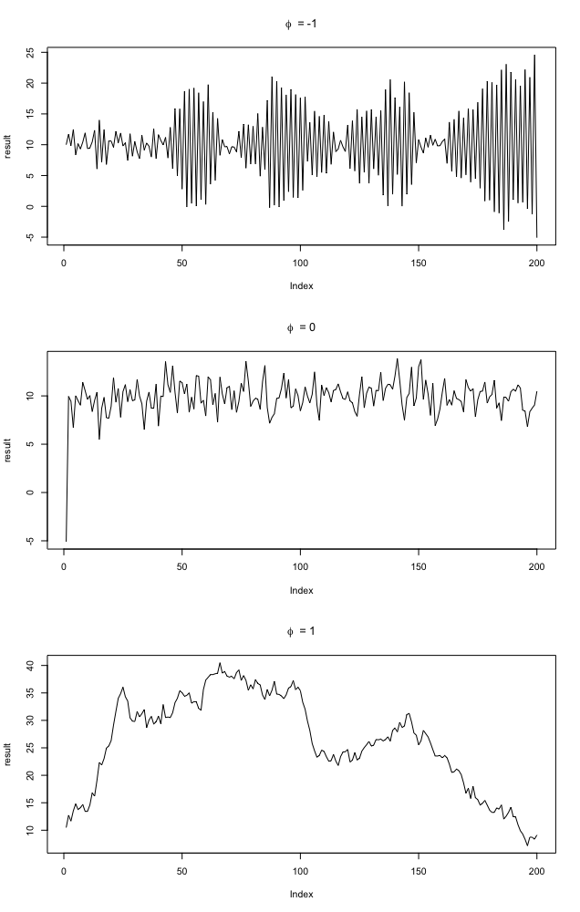
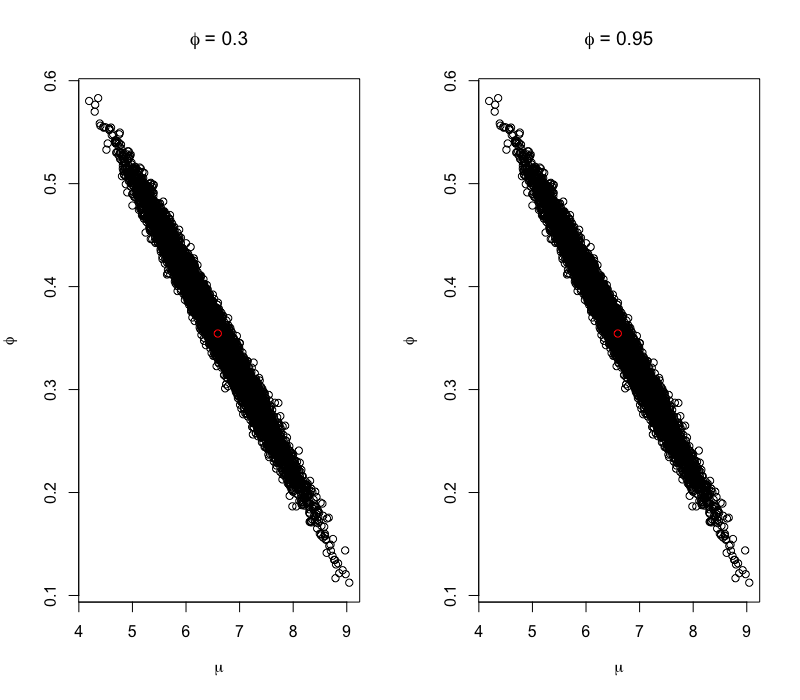
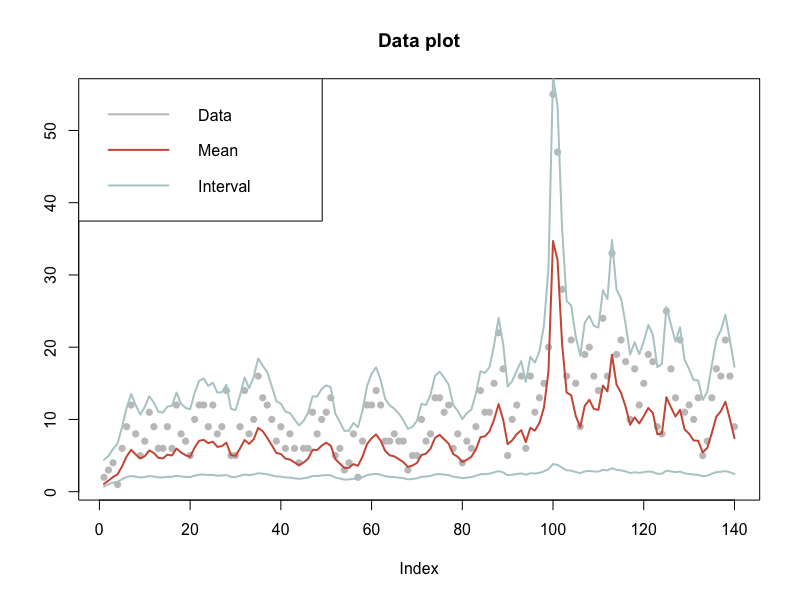
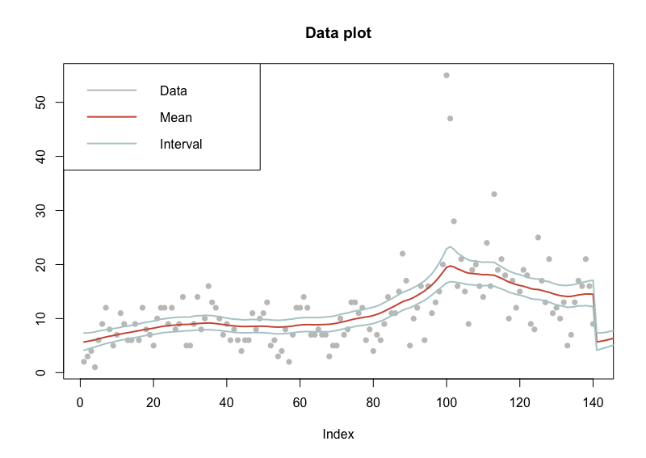

```{r setup, include=FALSE}
knitr::opts_chunk$set(echo = TRUE)
```


\newpage

# 1 - Time series models in Stan

## 1a) AR(1)-process


\newpage

It is clear that $\phi$ has a large effect on x~1:T~. The figure above depicts 3 different scenarios where $\phi$ is equal to -1, 0 and 1. In the first example, we have that
\begin{center}
x~t~ = $\mu$ - (x~t-1~ - $\mu$) + $\epsilon_t$
\end{center}
As can be seen in the figure above the values of x~t~ oscillate between positive and negatiive values when $\phi = -1$. This is because $\phi$ changes the sign of x~t~ in each iteration. 

When  $\phi = 0$ we have that
\begin{center}
x~t~ = $\mu$ + $\epsilon_t$ 
\end{center}
In this case the value of x~t~ only depends on $\mu$ and $\epsilon_t$, meaning the values will be close to $\mu$. 

In the last example we have that
\begin{center}
x~t~ = $\mu$ + (x~t-1~ - $\mu$) + $\epsilon_t$
\end{center}
In this case, x~t~ value depends on the previous value but won't change sign in each iteration as long as the error is fairly small. 

\newpage

## 1b) 

Using our AR-function defined in a) resulted in the following values for the posterior mean and the upper and lower limits of the 95 % credible intreval. 

\begin{table}[ht]
\center
\begin{tabular}{|l|l|l|l|}
\hline
phi=0.95 & Posterior mean & Lower limit & Upper limit \\ \hline
mu       & 0.819          & 0.275       & 1.380       \\ \hline
sigma2   & 1.841          & 1.508       & 2.256       \\ \hline
phi      & 0.901          & 0.838       & 0.961       \\ \hline
\end{tabular}
\end{table}

\begin{table}[ht]
\center
\begin{tabular}{|l|l|l|l|}
\hline
phi=0.30 & Posterior mean & Lower limit & Upper limit \\ \hline
mu       & 6.275          & 4.942       & 7.581       \\ \hline
sigma2   & 2.131          & 1.741       & 2.610       \\ \hline
phi      & 0.379          & 0.251       & 0.510       \\ \hline
\end{tabular}
\end{table}

The convergence of $\phi$ and $\mu$ can be seen by plotting the parameters in the same graph. The red dot represent the posterior mean of each parameter. The shape of the joint distribution of $\phi$ and $\mu$ is the same for different initial values of $\phi$. 

{height=60%}

\newpage

## 1c)

The figure below shows a plot of the data as well as the posterior mean and a 95 % credible interval for the letaent intensity. 

 


\newpage

## 1d)

Here the prior for $\sigma^2$ has been modified to be informative. We set the prior to be 
\begin{center}
$\sigma^2 \sim Gamma(1,1000)$
\end{center}

Since the prior for sigma has a mean close to 0 and low variance, the effect of the error in the regression model has decreased.

The modified prior had an effect on the posterior mean to be less sensitive to the data. This is an expected outcome since the prior, by being more informative, had a larger impact on the posterior. 



\newpage

# Code - 1

```{r, echo=TRUE, eval=FALSE}
library('rstan')

########## A ##########
mu <- 10
sigma_sq <- 2
T <- 200 
x <- mu

par(mfrow=c(3,1))

AR <- function(mu, prev_x, phi, sigma_sq) {
  error <- rnorm(1, 0, sqrt(sigma_sq))
  return (mu + phi * (prev_x - mu) + error)
}

phis <- c(-1,0.1,0.95)

for(phi in phis) {
  result = c(x)
  for (i in 2:T) {
    x <- AR(mu, x, phi, sigma_sq)
    result <- c(result, x)
  }
  plot(result, type = 'line', main = bquote(phi ~ ' =' ~ .(phi)))
}


########## B ##########

mu <- 10
sigma_sq <- 2
T <- 200 
x <- mu

phis <- c(0.3, 0.95)

X = c()
for(phi in phis) {
  result <- c(x)
  for (i in 2:T) {
    x <- AR(mu, x, phi, sigma_sq)
    result <- c(result, x)
  }
  X <- rbind(X, result)
}

model <- stan_model('StanNormalModel.stan')

fitX <- sampling(model, data = list(T=200, x=X[1,]), iter = 3000, warmup = 500)
fitY <- sampling(model, data = list(T=200, x=X[2,]), iter = 3000, warmup = 500)

# Print the fitted model
print(fitX,digits_summary=3) # Extract posterior samples
print(fitY,digits_summary=3) # Extract posterior samples

postDrawsX <- extract(fitX)
postDrawsY <- extract(fitX)

par(mfrow=c(1,2))
plot(postDrawsX$mu, postDrawsX$phi, main = expression(phi ~ '= 0.3'), ylab=expression(phi), xlab=expression(mu))
lines(mean(postDrawsX$mu), mean(postDrawsX$phi), type='p', col="red")
# legend('topright', legend=expression(mean(postDrawsX$mu) ~ ',' ~ mean(postDrawsX$phi)))
plot(postDrawsY$mu, postDrawsY$phi, main = expression(phi ~ '= 0.95'), ylab=expression(phi), xlab=expression(mu))
lines(mean(postDrawsY$mu), mean(postDrawsY$phi), type='p', col="red")
# legend('topright', legend=expression(().mean(postDrawsY$mu) ~ ',' ~ ().mean(postDrawsY$phi)))

########## C ##########
library(ggplot2)
data <- read.table('campy.txt', header=TRUE)

N <- length(data$c) 

model <- stan_model('StanPoissonModel.stan')
fit <- sampling(model, data = list(N=N, c=data$c), iter = 2000, warmup = 1000)

# Print the fitted model
print(fit,digits_summary=3) # Extract posterior samples
postDraws <- extract(fit)

x <- postDraws$x

xMean <- c()
thetaUp <- c()
thetaLow <- c()

for (i in 1:length(x[1,])) {
  xMean <- c(xMean, exp(mean(x[,i])))
  thetaUp <- c(thetaUp, exp(quantile(x[,i], probs = 0.975)))
  thetaLow <- c(thetaLow, exp(quantile(x[,i], probs = 0.025)))
}

# draws <- c()
# for(i in 1:140) {
#   draws <- c(draws, rpois(1, exp(xMean[i])))
# }

draws <- rpois(140, exp(xMean))

plot(data$c, pch=16, col='gray77', ylab='', main='Data plot')
lines(xMean, col='lightcyan3', lwd=2)
lines(thetaUp, col='lightcyan3', lwd=2)
lines(thetaLow, col='coral3', lwd=2)
legend('topleft',legend = c('Data', 'Mean','Interval'), 
       col = c('gray77', 'coral3', 'lightcyan3'), lwd=2)
dev.off()
# geom_ribbon(mapping = aes(seq(1,140,1), ymin = thetaLow, ymax = thetaUp), alpha = 0.25)

# Do traceplots of the first chain
par(mfrow = c(1,1))
# plot(postDraws$mu[1:(1000)],type="l",ylab="mu",main="Traceplot")
# Do automatic traceplots of all chains
# traceplot(fit)
# Bivariate posterior plots
pairs(fit)
# plot(fit)

########## D ##########

data <- read.table('campy.txt', header=TRUE)

N <- length(data$c) 

model <- stan_model('StanPoissonModelD.stan')
fit <- sampling(model, data = list(N=N, c=data$c), iter = 2000, warmup = 1000)

# Print the fitted model
print(fit,digits_summary=3) # Extract posterior samples
postDraws <- extract(fit)

x <- postDraws$x

xMean <- c()
thetaUp <- c()
thetaLow <- c()

for (i in 1:length(x[1,])) {
  xMean <- c(xMean, mean(exp(x[,i])))
  thetaUp <- c(thetaUp, quantile(exp(x[,i]), probs = 0.975))
  thetaLow <- c(thetaLow, quantile(exp(x[,i]), probs = 0.025))
}

plot(data$c, pch=16, col='gray77', ylab='', main='Data plot')
lines(xMean, col='coral3', lwd=2)
lines(thetaUp, col='lightcyan3', lwd=2)
lines(thetaLow, col='lightcyan3', lwd=2)
legend('topleft',legend = c('Data', 'Mean','Interval'), 
       col = c('gray77', 'coral3', 'lightcyan3'), lwd=2)

```

\newpage

# Stan Model for b)

```{stan output.var='stan', eval = FALSE, tidy = FALSE}
data {
  int<lower=0> T; // Number of observations 
  real x[T];
}

parameters {
  real mu; 
  real<lower=0> sigma2; 
  real<lower=-1, upper=1> phi;
}
 
model {
  //priors
  // mu ~ normal(10,2);
  // phi ~ uniform(-1,1);
  // sigma2 ~ scaled_inv_chi_square(1,2); // Scaled-inv-chi2 with nu 
  // 
  //likelihood
  for (t in 2:T)
    x[t] ~ normal(mu + phi * x[t-1], sqrt(sigma2));
}
```

\newpage

# Stan Model for c)

```{stan output.var='stan', eval = FALSE, tidy = FALSE}
data {
  int<lower=0> N; // Number of observations
  int c[N];
}

parameters {
  real mu;
  real<lower=-1,upper=1> phi;
  real<lower=0> sigma;
  real<lower=0> x[N]; // Data points
}

transformed parameters {
  real lambda[N]; 
  lambda = exp(x);
}

model {
  //likelihood
  for(n in 1:N) 
    c[n] ~ poisson(lambda[n]);
      
  //prior
  for(n in 2:N)
    x[n] ~ normal(mu + phi * x[n-1], sigma);
}
```

\newpage

# Stan Model for d)

```{stan output.var='stan', eval = FALSE, tidy = FALSE}
data {
  int<lower=0> N; // Number of observations
  int c[N];
}

parameters {
  real mu;
  real phi;
  real<lower=0> sigma;
  real<lower=0> x[N]; // Data points
}

transformed parameters {
  real lambda[N]; 
  lambda = exp(x);
}

model {
  //likelihood
  for(n in 1:N) 
    c[n] ~ poisson(lambda[n]); // Poisson
      
  //prior
  mu ~ normal(10,2);
  phi ~ normal(0, 1);
  sigma ~ gamma(1,1000);
  
  for(n in 2:N)
    x[n] ~ normal(mu + phi * x[n-1], sigma);
}
```